While completing my math degree at Reed College I had the chance to study abroad at the [Budapest Semesters in Mathematics](https://www.budapestsemesters.com/). The experience was fantastic, I would encourage anyone with a passion for math and room in their schedule to consider the program. This posting is meant to be a sort of advertisement of the opportunities that Hungary and travel nearby offer.

## Destinations in Budapest
Within Budapest I have the chance to live just a minutes walk away from the beautiful Keleti Pályaudvar, an international train station in Pest. 
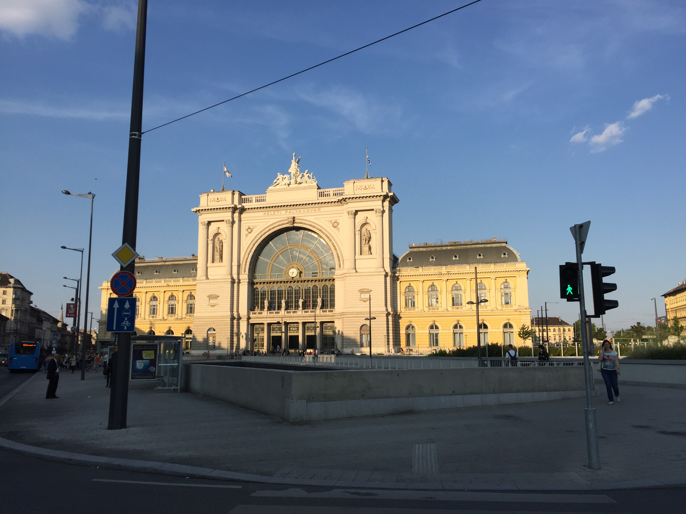
The Budapest Semesters in Mathematics is hosted at the McDaniels School which is four blocks north of Keleti Pályaudvar. The building also hosts several other international programs, including several for european students preparing for medical school examinations. 
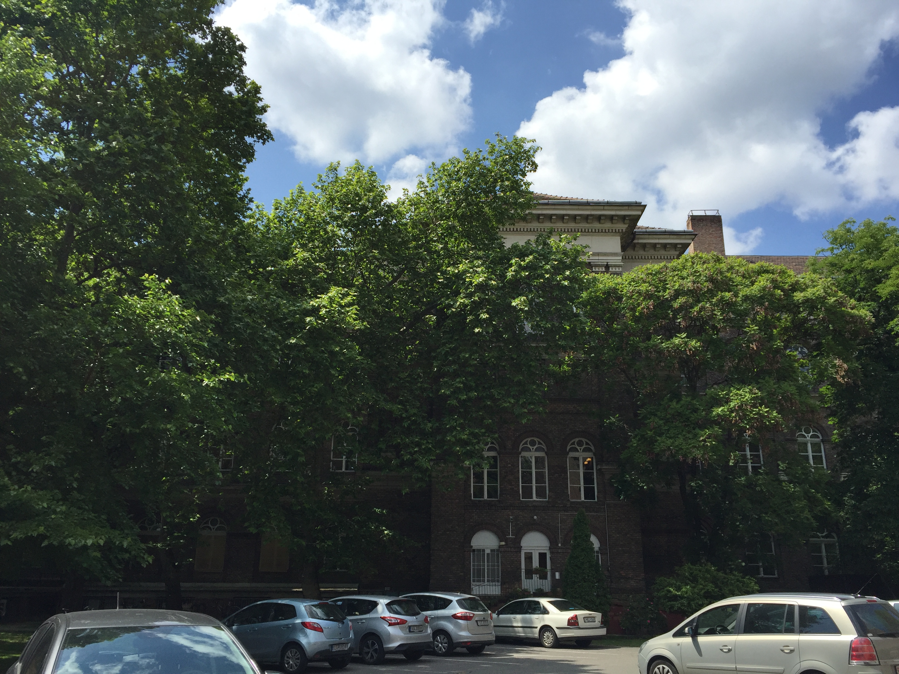
The Budapest Semesters pairs students with fantastic Hungarian mathematicians from the Alfréd Rényi Institute of Mathematics, the Mathematical Institute of the Hungarian Academy of Sciences, Eötvös University and Budapest University of Technology and Economics. Here Gergely Harcos teaches our course in Complex Analysis. 
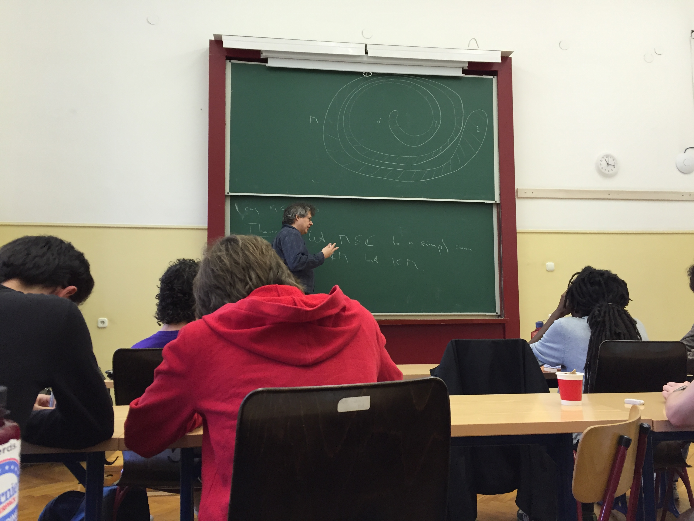
Sight seeing in Budapest is amazing. Here is a view of the Liberty Bridge and above to the right Gellért Hill and the Citadella.
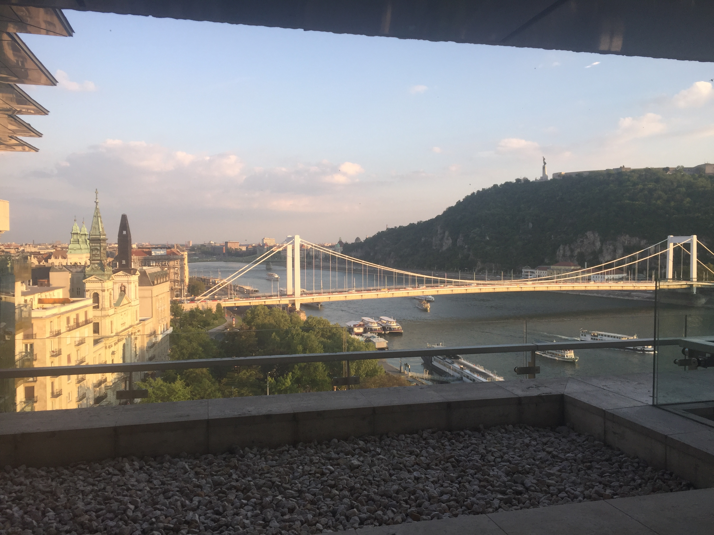
The walk up to the Citadella itself is quite beautiful. 

The view from the hill top is remarkable as well. 
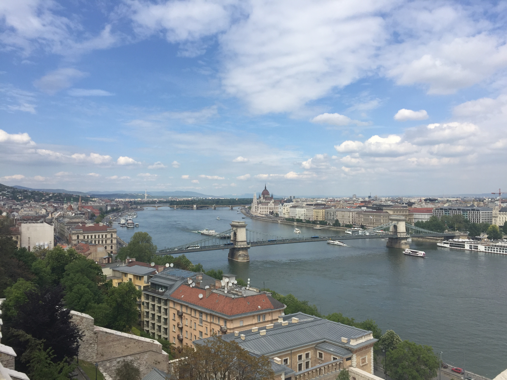
North of the Citadella is Fisherman's Bastion. Within the bastion is the beautiful Mátyás Church and equally beatiful view of the city down the hill to the east.
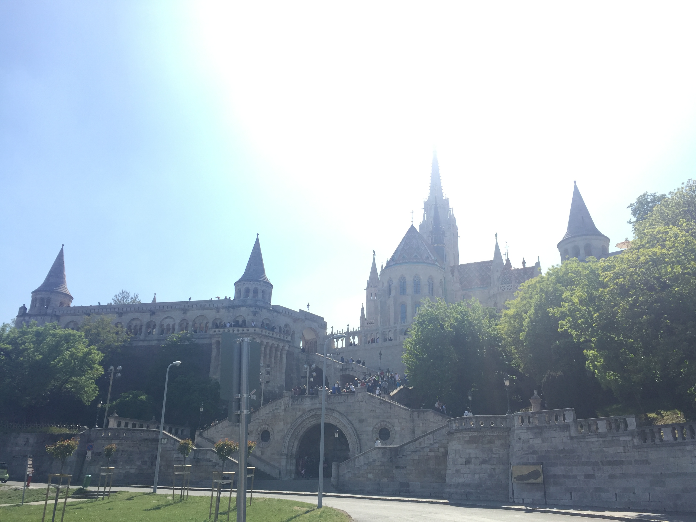
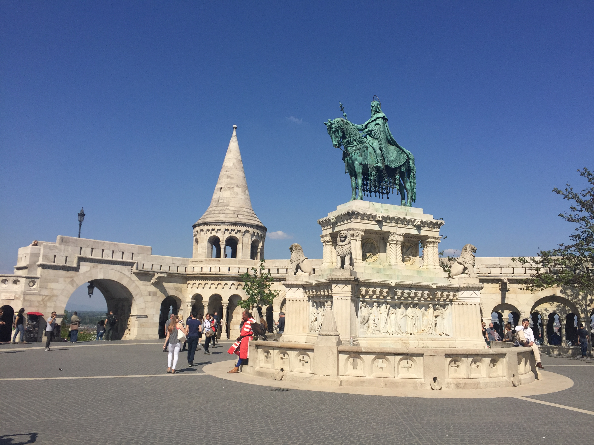
From down the hill the east facing view of the Hungarian Parliament across the river is astounding. 

The Parliament is also magnificent from the rear in Pest. 

Nearby is the beautiful St. Stephen's Basilica and nearby amazing rose-shaped icecream at Gelarto Rosa. 
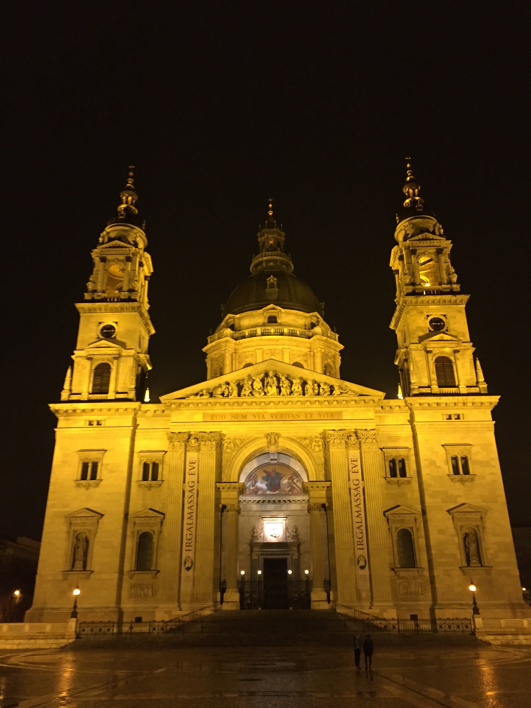
Above all though, the experience allowed me to build amazing friendships through the comradery of difficult and interesting courses.
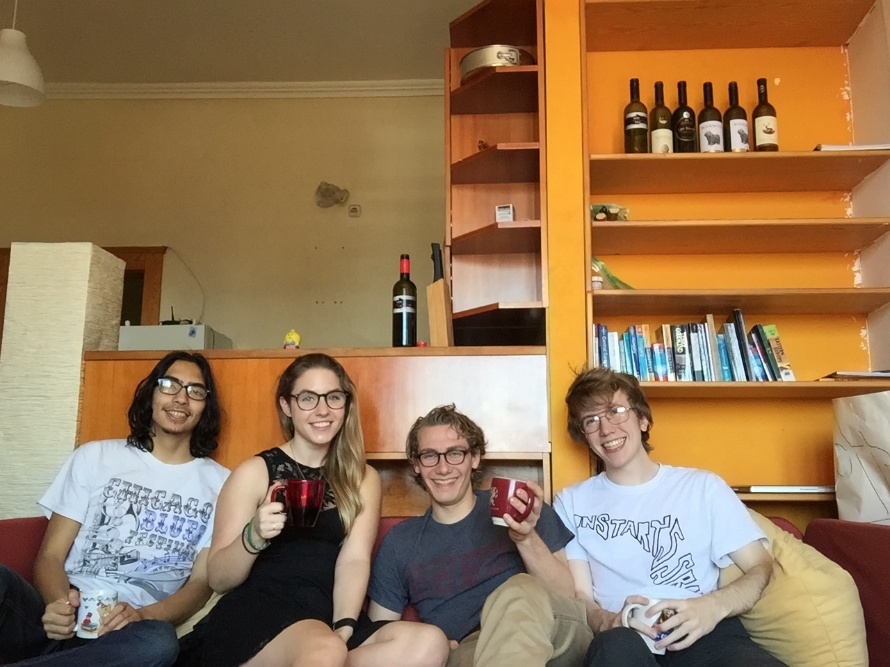

## Travel
Beyond the opportunity to explore a beautiful city, Eastern Europe is amazingly accessible by train and plane. It is incredibly cheap to travel to amazing places, especially when a beautiful city is a minute's walk to the train station away. This meant that Spring break was as luxurious as any ever had.

I had the chance to travel to Barcelona

And Berlin
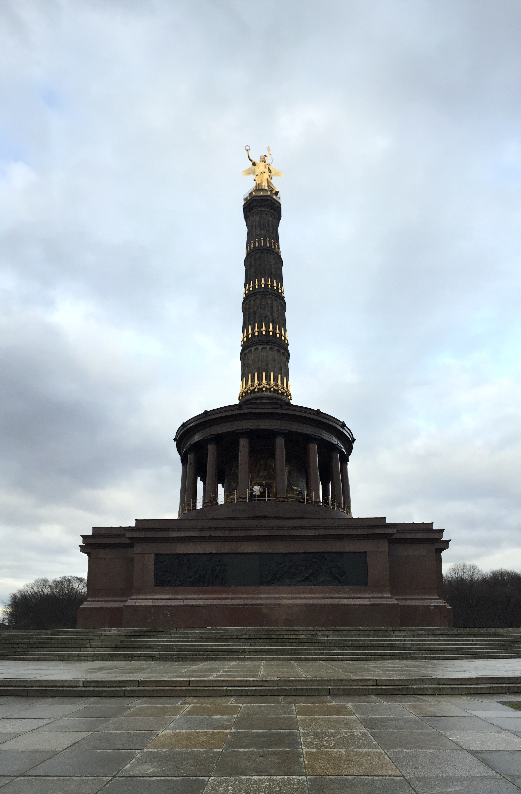

When the semester came to an end I took the opportunity of being where I was to cross destinations off of my wish list. In Rome I saw the Collesium, the Roman Forum and numerous other attractions.

Florence was perfect for beautiful walks by the river and an unhealthy amount of gelato.
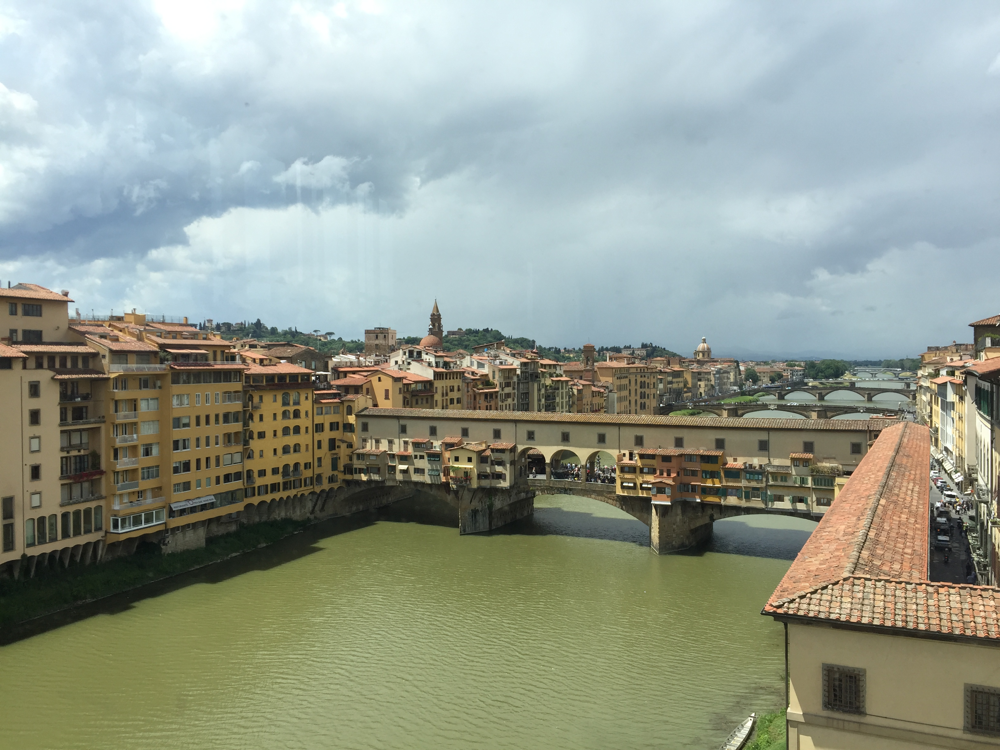
Venice was truely a dream city. The trip was completed by a visit to the Elektra SLR factory in nearby Treviso. 
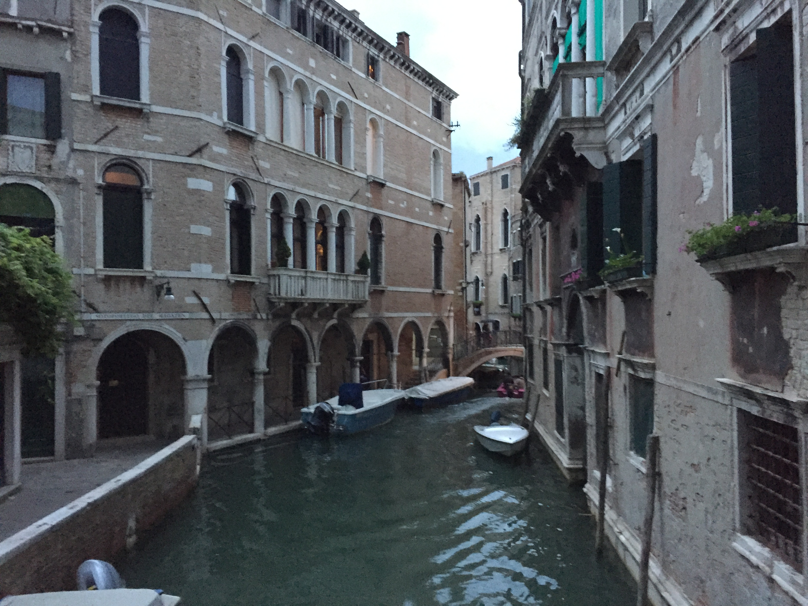