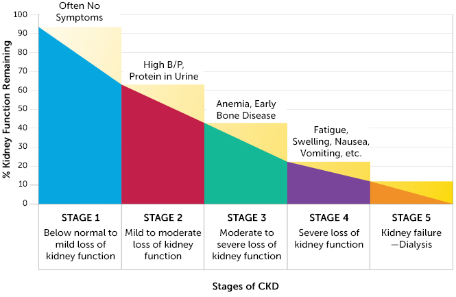
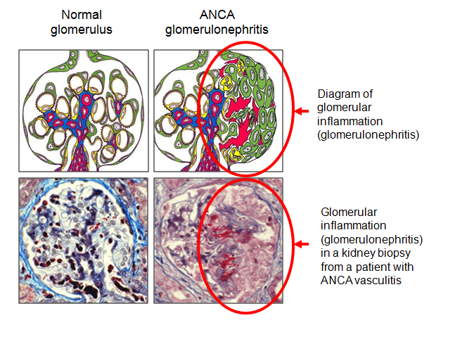
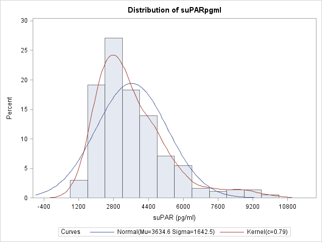
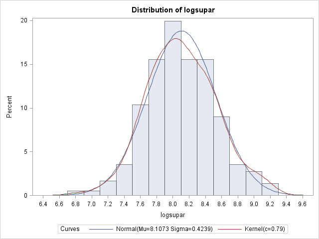
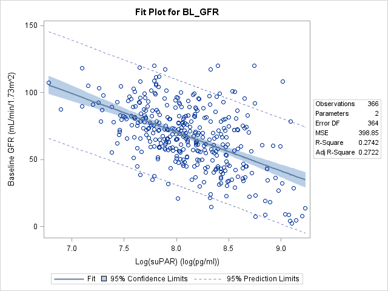
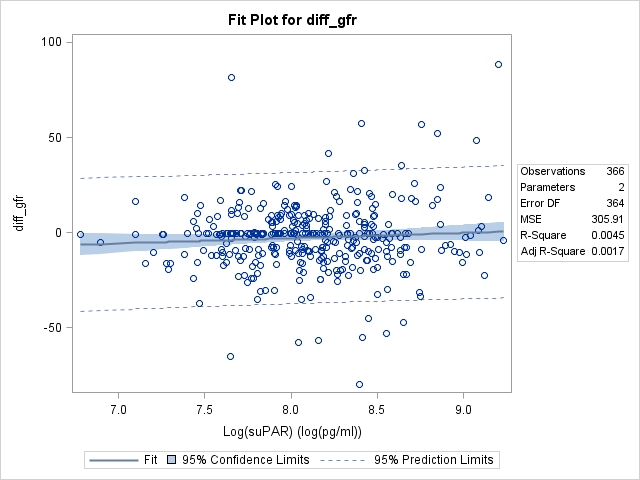
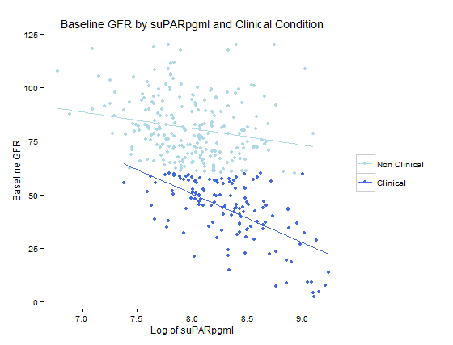

# Summer Institute in Biostatistics
In 2015 I particpated in [Emory University's Summer Institute in Biostatistics](https://sph.emory.edu/departments/bios/sibs/index.html) funded by [The National Heart, Lung and Blood Institute](https://www.nhlbi.nih.gov/research/training/summer-institute-biostatistics-t15). 

As part of this program we investigate the risk factors associated with Chronic Kidney Disease. 
# Introduction
Chronic Kidney Disease (CKD), the ninth leading cause of death in the United States, affects 26 million Americans and is characterized by the gradual decline in kidney function. CKD has many etiologies ranging from hypertension to diabetes to infections and inflammation damaging renal tissue. Mortality and disability from the later stages of the disease is staggering due to the physical toll of dialysis and long renal transplant waitlists. Early diagnosis and quality predictive tools to prevent progression would greatly reduce the toll of CKD.

Progression of the disease is measured by a staging scale, with Stage 0 indicating normal physiology and Stage 5 indicating end stage kidney failure, which is fatal without dialysis or a kidney transplant. The Glomerular Filtration Rate (GFR) is used to determine an individual’s CKD stage. The GFR is a measurement of nephron functioning. GFR is calculated from an individual’s creatinine levels, a breakdown product of creatine normally excreted efficiently by the kidneys. Not all patients with CKD will progress to the latter stages and some will even improve. Because of this, being able to predict kidney decline would be helpful for determining which patients to put through higher intensity treatments.

|  Stage   | GFR Levels (mL/min/1.73m 2 ) |
|----------|------------------------------|
| Stage 1  | GFR$$ \ge 90$$               |
| Stage 2  | $$60\le $$ GFR $$ \le 90$$   |
| Stage 3A | $$45\le $$ GFR $$ \le 60$$   |
| Stage 3B | $$30\le $$ GFR $$ \le 45$$   |
| Stage 4  | $$15\le $$ GFR $$ \le 30$$   |
| Stage 5  | GFR $$ < 90$$                |

Certain biomarkers may be useful in predicting kidney decline and screening for CKD. One biomarker of interest is suPAR, soluble urokinasetype plasminogen activator receptor. In normal conditions, suPAR is noted for activating the breakdown of blood proteins during vascular reorganization and wound healing. However in pathological conditions, suPAR is correlated with inflammation in the blood vessels.

This study sought to investigate:

1. The relationship between kidney function and suPAR, 
1. The relationship between suPAR and GFR atthe time of patient enrollment, and 
1. If suPAR levels could predict the decline of kidneyfunction at one year or the risk or progression of CKD stage.
 
In the investigation of these questions, we also looked at other biological factors that may influence the studied relationships. These factors included diabetes, Creactive protein, and GFR at the time of enrollment. Diabetes is a major known risk factor for kidney disease. Creactive protein (CPR) is an activator of the innate immune system during infection, but because of its implication in inflammatory diseases, we included it as a potential factor in our study. 
# Methods
We conducted a prospective observational study with data from the Emory Cardiovascular Biobank, which was established to investigate vascular and cardiovascular diseases. Patients were recruited from the hospital cath lab; data from a total of 366 patients was used. Data came from questionnaires filled out by patients in the waiting room, as well as from chart review. Patients also participated in a followup appointment approximately one year (between 300 and 430 days) after their enrollment in the study. Variables measured for each patient included:

- Enrollment date and followup date
- Concentrations of suPAR, CPR, and creatinine
- Calculated GFR at enrollment and followup
- Gender and race
- BMI
- History of myocardial infarction
- Diagnosis of diabetes, dyslipidemia, proteinuria, and coronary heart disease
- History of smoking
- Use of ACE inhibitors or angiotensin II receptor blockers.

Because of the nonnormal distribution of suPAR levels, a log transformation was performed, which normalized the variable. Multiple linear regression models were created, using stepwise selection, to first find the relationship between suPAR and GFR baseline, and then the relationship between suPAR and the difference of GFR at followup versus enrollment. Next, a multiple logistic regression model was created to determine whether suPAR can be used to predict CKD progression. CKD stages were correlated to each patient based on their GFR levels, both at baseline and at followup.

In order to conduct our analysis, the variables of clinical CKD and CKD decline were calculated. If a patient had a GFR level of 60 mL/min/1.73 $$m^2$$ or higher at enrollment, then they were categorized as having clinical kidney disease. If a patient progressed to a higher stage of CKD at followup, their health was determined to have declined.

We checked for confounding variables and interactions in our models with a special focus on diabetes, Creactive protein blood concentrations, and baseline GFR. Variables were considered confounding if they had an effect on the slope of the relevant model when included. Interactions occur when an interaction term, one that multiplies the variable of interest with the potential interaction variable, proves significant (p<.05) when included in the model.

# Results

## The Relationship between suPAR and GFR at Baseline

There is a weakly negative, but statistically significant, relationship between suPAR and baseline GFR (p<.0001). The model was improved by adjusting for patient’s age and clinical CKD at baseline. In the equation, the slope of the log of the suPAR variable is 32.82, meaning that for every 1 unit increase of the natural log of suPAR, the expected baseline GFR decreases by approximately 32 ml/min/1.73 $$m^2$$. Variance inflation factors were all less than 10, meaning multicollinearity is not present.

|       | Y =  | 197.43  | - 12.90 $$ X_1 $$ | - 0.22 $$ X_2 $$ | - 32.82 $$ X_3 $$ |
| $$R^2$$ | 0.69 | (15.27) | (1.91)          | (0.06)         | (1.74)          |

* Y: GFR
* $$X_1$$: Natural log of suPAR (pg/mL)
* $$X_2$$: Age
* $$X_3 = \begin{cases}{1 \text{ Clinical at Baseline}\\ 0 \text{ Not Clinical at Baseline}}\end{cases}$$

Of note, although there was no evidence of confounding variables, there was a significant interaction between the log transformed suPAR and patient’s clinical CKD status at baseline. Taking into account a significant interaction between baseline clinical and logsuPAR introduces a multicollinearity problem without greatly improving the fit of the new model ($$R^2$$ of new model =0.70). The model of the equation above is the most parsimonious model and holistically best represents the relationship. No interactions were found between logsuPAR and CRP or diabetes.

## Baseline suPAR As Predicter for Decline of Kidney Function at 1 Year

A simple linear regression found that logsuPAR levels at baseline were not able to predict decline of kidney function, as measured by the difference in GFR values at 1 year compared to baseline (p=.20). A multiple linear regression model still found logsuPAR to be a statistically insignificant predictor (p=.18). No significant confounders or interactions were found in this model. The lack of significance indicates that we have insufficient evidence to suggest that suPAR levels can act as a predictor for a decline in kidney function at 1 year.

## Baseline suPAR as Predicter for of CKD Stage Progression Risk

According to the logistic regression that was run, there was significant prediction power of suPAR measured at baseline in relation to the risk of CKD stage progression, where stage progression was defined as advancing to a higher classification of GFR level. Holding whether or not GFR was clinical at baseline constant, we are 95% confident that the odds of a certain logsuPAR value experiencing a CKD stage progression was between 1.38 and 5.12 times the odds of a logsuPAR value one unit lower than the original (p=0.0036). No significant confounders or interactions were found in the model.

|         | $$Y$$ =    |  -8.73 | + 0.98 $$X_1$$ | - 0.70 $$X_2$$ |
| P value | 0.0036 | 0.0012 | 0.0036         | 0.022          |

* $$Y= \begin{cases}{1 \text{ Stage Progression Likely}\\ 0 \text{ Stage Progression Unlikely}}\end{cases}$$
* $$X_1$$: Natural Log of suPAR (pg/mL)
* $$X_2 = \begin{cases}{1 \text{ Clinical at Baseline}\\ 0 \text{ Not Clinical at Baseline}}\end{cases}$$

# Conclusion
In answering our research questions, we found that suPAR has a negative relationship with baseline GFR levels. The results suggest that suPAR cannot be used to predict decline of kidney function a year later, as determined by GFR levels, but that it can be used to estimate the risk of CKD stage progression. In none of the models did we find significant and relevant interactions with variables such as diabetes, Creactive protein, and baseline GFR.

There are significant limitations to this study. A risk factor for kidney disease not measured in this study is a family history of kidney disease. As for the risk factors of diabetes and race, although they were included in this study, they were not measured completely. If this study were to be repeated, it should include other racial groups, specifically Asian Americans and Native Americans, which are two populations that are at risk for CKD. Also, more comprehensive questions should be asked about patients’ management of diabetes, given that it is such a significant risk factor for CKD.