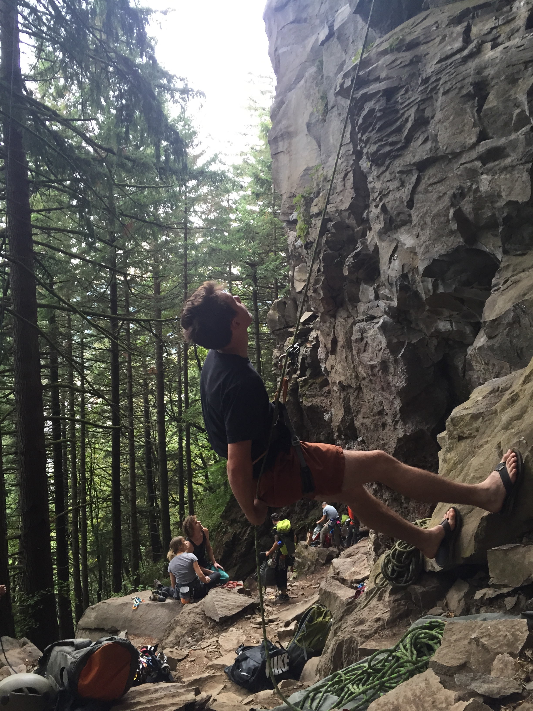

The community that comes with climbing is one of the best parts of the sport. The Reed College Mountaineering Club helped me to feel comfortable and taught me to love the sport.

I first had the chance to climb outdoors with the club at Smith Rock in eastern Oregon. 

I learned that climbing outdoors was nothing like my gym experience.

With the support of the club I decided to spend the time to get certified as a Wilderness First Responder through the Wilderness Medical Training Center. Safety first!

Armed with first aid training, I was comfortable enough to get out and climb on my own in Joshua Tree, California.

Also with the support of friends I had the chance to get out during the week and practice leading at Broughton Bluff and Ozone just outside of Portland, Oregon. 

Soon I felt comfortable on multi-pitch climbing and set out to climb Monkey's Face at Smith Rock, Oregon. We approached the northern side and reached the bolt-ladder after a few pitches. We made it into the 'mouth', the cave on the right side of the pillar.

The view from the mouth is astonishing.

<!--After a frightening traverse out the side of the mouth, we made it to the top of the Monkey's Face head.

 -->

And eventually I had the chance to return to Smith Rock once again with the Mountaineering Club. 

I had the chance to repay the favor of leading and belaying newer climbers up a few routes. It's a nice feeling to have made it full-circle. 

Afterwards we stopped by Juniper Junction for some of their famous Huckleberry ice cream. 

