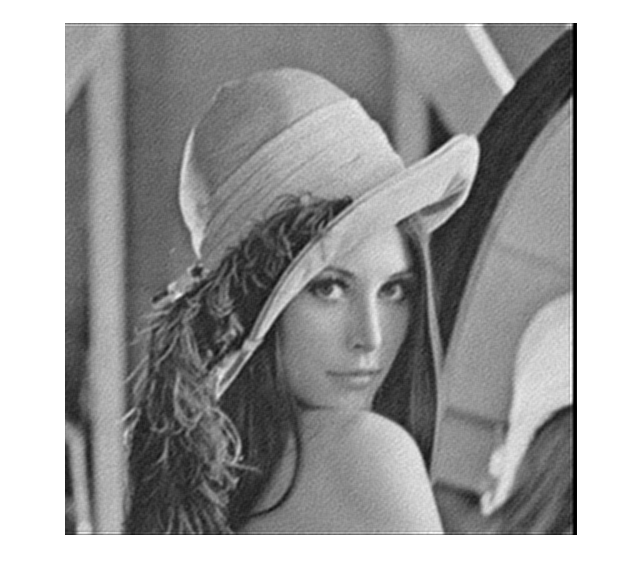
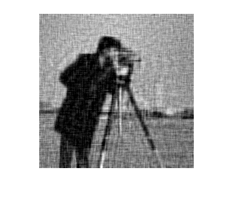
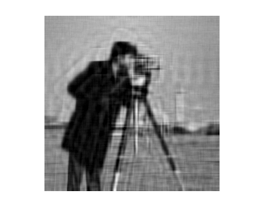
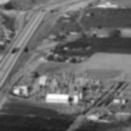
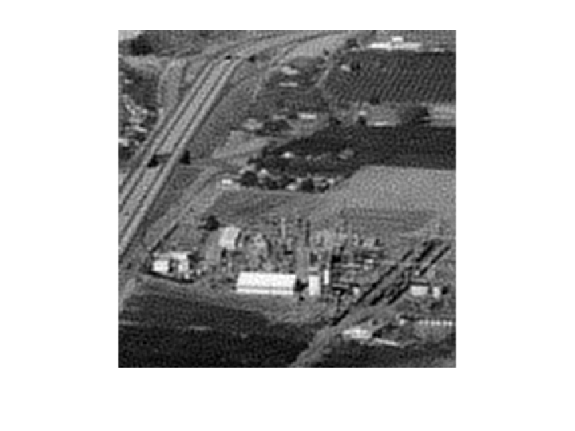

We seek to find the image $f$ which minimizes the following given an input image $g$

$$O(f) = \underset{f}{\max}\|\vec g-(M\vec f)\|_2^2 +\lambda \|\Gamma\vec f\|_2^2$$

Here $M$ is a low-pass filtering operator, $\Gamma$ is a high-pass filter and $\lambda$ is a regularization parameter, yet to be determined. We see that the gradient of the objective function is given as 

$$\frac{\partial O}{\partial \vec f} = -M^T(\vec g-M\vec f) +2\lambda \Gamma^T\Gamma \vec f$$

We observe that any optimal $f$ must be stationary; that is it must have gradient zero. From this we obtain the following necessary condition to optimality. 

$$\frac{\partial O}{\partial \vec f} = 0 \Leftrightarrow \left(M^TM+ 2\lambda \Gamma^T\Gamma\right) \vec f = M^T \vec g$$

Now for the sake of putting together concepts personally I have chosen to solve this directly. The theory is very pretty but the practicality of it requires some nitpicking with padding. We note that $K=kk^T$ is given as a separable kernel in each of the problems. Now the circulant convolution of $f$ and a $1$-dimensional kernel is given as follows 

$$f\ast_c k = \textit{circulant}(k^T) f$$

Where $\textit{circulant}(k^T)$ is a special Toeplitz matrix, known as a 'circulant' matrix. Then the non-circular convolution is given by padding $k$ sufficiently. Let $f\in \mathbb{R}^{n\times p}$ and $\textit{length}(k)=m$, we define the following functions
$$\textit{circulantPad}(k^T) = \textit{circulant}([k,0_{1 \times (\max(n,p)+\lfloor m/2 \rfloor + 1)}])$$
and pad $f$ first by $\textit{padSquare}(f)$ which appends rows or columns of trailing $0$s such that $f$ is square, then

$$\textit{pad}(f) = \begin{bmatrix}0_{\lfloor m/2\rfloor\times\lfloor m/2\rfloor} & 0_{\lfloor m/2\rfloor\times \max(n,p) } & 0_{ \lfloor m/2\rfloor\times m+1 }\\ 0_{\max(n,p)\times\lfloor m/2\rfloor} &  \textit{padSquare}(f) & 0_{\max(n,p)\times m+1} \\ 0_{m+1 \times \lfloor m/2\rfloor} & 0_{m+1\times \max(n,p)} & 0_{m+1\times m+1}\end{bmatrix}$$

As short hand we denote $\hat{f} = \textit{pad}(f)$, and we denote the inverse of as chop $\textit{pad}^{-1}(\hat{f}) = \textit{chop}(\hat{f})= f$. We note that 

$$f\ast k = \textit{chop}\left(\textit{circulantPad}(k^T)\textit{pad}(f)\right)$$

Let $C = \textit{circulantPad}(k^T)$ and $\hat{f} = \textit{pad}(f)$ This means that 
$$f\ast (kk^T)= k\ast f \ast k = \textit{chop}(C\hat{f} C )$$
Now this tells us what $M$ must be when we use a filter $K$, by using the Kronecker product and properties of vectorization
$$\textit{vec}\left(f\ast (kk^T)\right) = \textit{chop}\left(C^H\otimes C \vec{\hat {f}} \right)$$
Thus we see that $M = C^H\otimes C$. Then we may use the special property that the circulant matrix $C$ is diagonalized by the Fourier transform matrix $F$ and it's conjugate transpose $F^H$

$$M = C^H\otimes C = \left(F^H\Lambda^H F\right)\otimes\left(F\Lambda F^H\right) = \left(F^H\otimes F\right) \left(\Lambda^H\otimes\Lambda\right) \left(F^H\otimes F\right)^H = F_M \Lambda_M F_M^H$$

Here we note that the Kronecker product of Hermitian matrices is Hermitian and Kronkecker product of diagonal is diagonal, such that this is diagonalizes $M$ as well. 
Then letting $\Gamma$ be the natural high pass filter given by the residual of $K$, we may write 

$$\Gamma = I - M = I\otimes I - C^H\otimes C$$

Finally we expand

$$
\begin{align*}
    \left(M^HM+ 2\lambda \Gamma^T\Gamma\right)  &= M^HM + 2\lambda\left(I\otimes I - M -M^H +M^H M \right)\\
    &= F_M \Lambda_M^H\Lambda_M F_M^H + 2\lambda\left(F_M F_M^H - F_M\Lambda_M F_M +F_M - F_M\Lambda_M^H F_M +F_M \Lambda_M^H\Lambda_M F_M^H \right)\\
    &= F_M \left( (1+2\lambda)\Lambda_M^H\Lambda_M - 2\lambda \Lambda_M -2\lambda \Lambda_M^H +2\lambda I\right)F_M^H
\end{align*}
$$

Now we know that to invert $F_M$ we just multiply by its conjugate transpose. Since there are efficient algorithms to evaluate a vector multiplied by a Kronecker product, we will never need to form $F_M$, only $F$. To invert the diagonal matrix $D = \left( (1+2\lambda)\Lambda_M^H\Lambda_M - 2\lambda \Lambda_M -2\lambda \Lambda_M^H +2\lambda I\right)$ is simply to divide element-wise. In fact this matrix is a sum of outer products of the vectors of eigenvalues and their conjugates. This means that we may solve $\left(M^TM+ 2\lambda \Gamma^T\Gamma\right) \vec f = M^T \vec g$ by computing the following
$$f = \textit{chop}\left(F_M\left(D^{-1} \left(F_M^H\left(\left(C^H\otimes C\right) \vec{\textit{pad}(g)}\right)\right)\right)\right)$$
This direct formulation allows us to ignore difficulties in choosing a step size and checking convergence. It should be noted that this direct method is only possible because both $M$ and $\Gamma$ are the operators for a convolution, meaning that they diagonalize via the FFT matrix. 
When running experiments I found that using the total variation gradient descent worked better than Tikhonov. Total variation is not implementable as a direct method as far as I'm aware so many of the results are generated via gradient descent. 
Now we display the input image along with its deblurred and denoised pair.

# Results

## Denoise Lena direct method with $\lambda = .06$

## Denoise Cameraman 25dB with direct method $\lambda = .025$

 

## Denoise Cameraman 40dB with direct method $\lambda = .025$

 

## Denoise Chemical Plant with $\lambda = .1$

 
