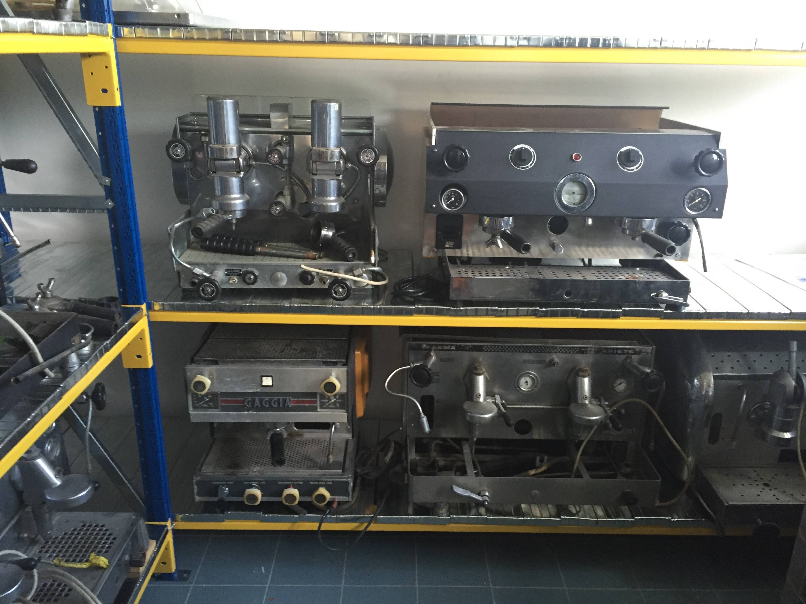

I was lucky enough to arrange a trip to tour the Elektra factory in Treviso, Italy which is a thirty minute train ride from Venice. I wanted to share some photos from the trip!

The trip was amazing! I had an amazing time and was just shocked at the amount of care put into every single machine. The experience really highlighted the quality of machine that this company produces!

The visit started in the assembly room. Most of the parts, except electronics are made here. Parts are welded, sanded, polished, fired and painted in this room. Here a Belle Epoque is being assembled. 

Boilers of my Microcasa a Leva's siblings waiting for a finish.

Next we were taken to a quality assurance and packaging room. The man pictured is running each machine for an initial mechanical inspection and checking for any issues with the finish. 

Next we were taken to the room where electronics were checked, boilers and groups checked and where each machine undergoes it's 48 hour final test.

The view of the testing area

A machine produced by request as a (relatively) high quality capsule machine.

The finished MCaLs being tested.

This room is equipped with an Elektra Semiautomatica and Elektra Nino so that the workers are happy and 'efficient'. 

At the rear of the room the shells are placed on larger machines.

And behind there is a test room with a variety of machines.

My tour guide and new friend Philippe posing.

The table where the first Elektra, originally "La Tarvisium", the ancient Latin name for Treviso, was created

Machines on display.

These machines are in storage at a back room for later restoration and display in an espresso museum at the factory. Philippe joked he's happy the job's not his, it'll be a lot of work!

We finished the trip in the display section of the usual welcoming center where there is a section of machines showing large developments to Elektras machines.

And a room of the current models.

And a final espresso shot prepared by Philippe, along with a few shots of history behind the counter.

An impressive collection of lever machines. 

A few books I was gifted to take home!