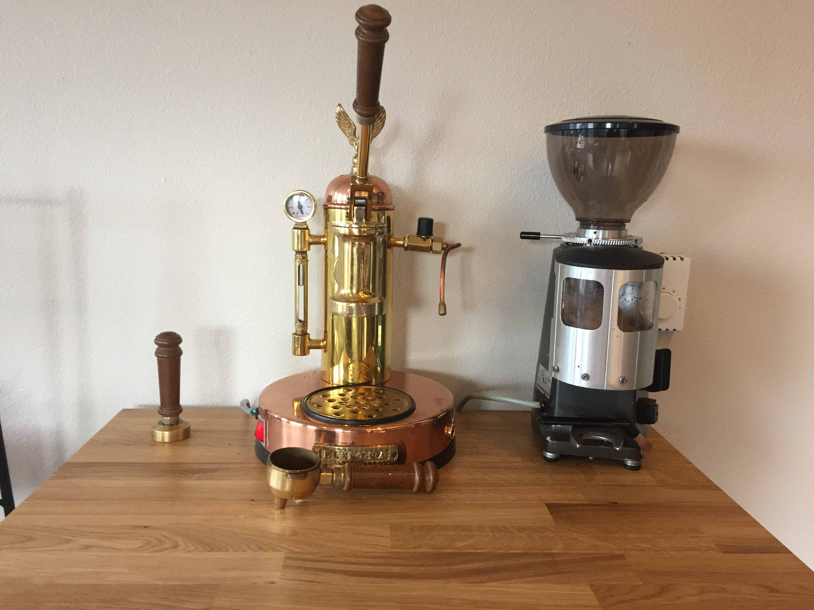
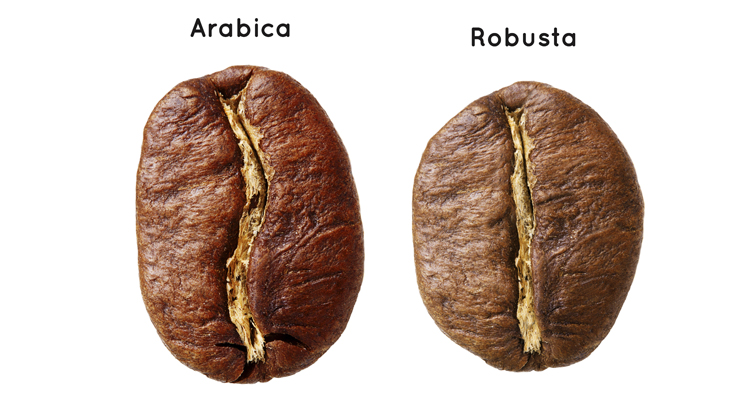
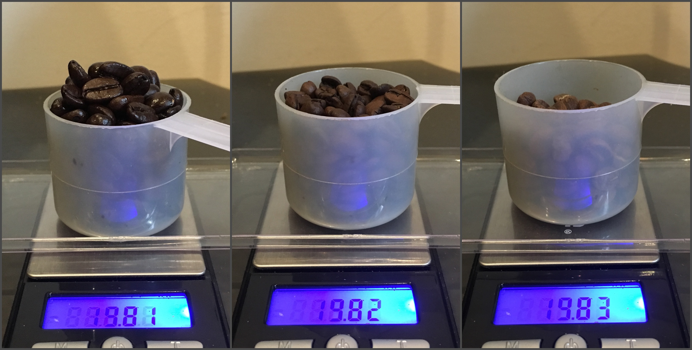
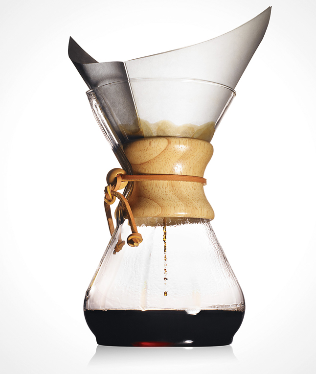
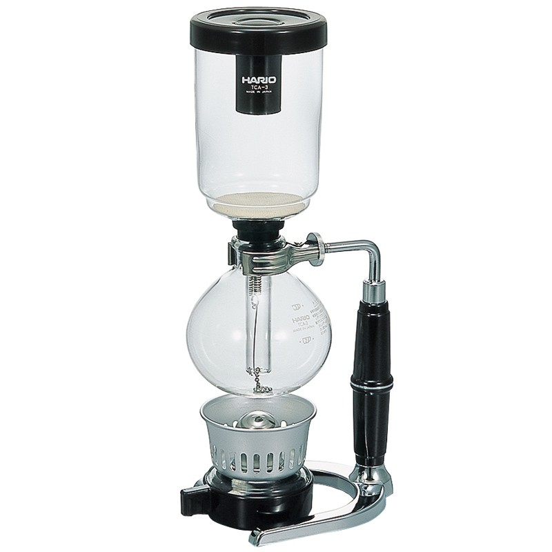

In the process we learn what is important in making great coffee: the beans, the roast, grind, the ratio, the brew time, the machine. The goal is to control these parameters to make a cup of coffee that is not diluted by managing the brew ratio, extracted properly. A finer grind leads to a longer brew time, while using less coffee simulateously may hold the brew time constant for some water-to-coffee ratio. These opposing effects are managed to find the sweet spot between over and under extraction. Under extraction causes a sour, metallic taste while over extraction causes bitter notes. The ideal balance leads to a cup that is almost sweet. 
## The Beans
### Arabica versus Robusta
The reference of this section is Andrea Illy's Espresso Coffee: The Science of Quality, an encyclopedic book reccomended to anyone interested in learning more about coffee. 

The general landscape is that arabica coffees are generally agreed to be better tasting while robusta coffees are higher in caffeine content and are generally more bitter. 

A third species of coffee known as liberica or excelsa contributes less than 1% of the world coffee crop, the remaining coffee is composed of arabica and robusta coffees. The two species are quite distinct in structure and reproduction. Arabica plants are self-fertile with less than 10% of plants being naturally cross pollinated, while robusta plants are self-incompatible. Interbreeding of varieties has been used to exploit qualities of yield and resistance to diseases such as Coffee Leaf Rust (CLR) which affect arabica coffees but which robusta plants are resistant to. This includes interspecific hybrids which introduce disease resistance into arabica coffees. 

> Between varieties of arabica coffees data from analytical test of the chemical composition of green beans are poorly correlated with the percieved cup quality... Differences between arabica and robusta coffees are more pronounced and better documented. For instance, the musty smell of robusta is attributed to the presence of 2-methylsoborneol (MIB) (Vitzthum *et al.*, 1990), and MIB ranged from 120-430 ng/kg in robusta verus a lever lower than 20 ng/kg in arabica (Bade-Wegner *et al.*,1993). This knowledge led to a practical application, whereby steam treatment of green robusta beans denatures MIB, and so is claimed to allow increased percentage of robusta in commerical coffee blends. 

The better taste of arabica coffees is often attributed to the presence of 60% more flavorful oils as well as it's lower levels of amino acids and chlorogenic acids when compared to robusta. Illy explains the correlation in more detail:

> Chlorogenic acids contribute to astringent notes, so the reduced amounts in arabica favours its final cup quality. It is known that many aromatic volatile compoiunds are dissolved (trapped) in oil droplets and released during brewing, so the oil fraction may explain some differences in cup quality between arabica and robusta, particularly in espresso. The influence of the relatve composition of the lipid fractions in coffee on final cup quality is not yet well understood. The major lipid fractions in arabica include (Fonseca and Gutierrez, 1971) linoleic acid (C18:1, 47%), palmitic acid (C16:0, 41%), oleic acid (C18:2, 6.4%) and stearic acid (C18:0, 6%).

As a quick reminder, the parenthetical elements above are lipid numbers. Lipid numbers take the form C:D, where C is the number of carbon atoms in the fatty acid and D is the number of double bonds in the fatty acid. 
## The Roast

Above we see differences in the roast time of the same beans with equivalent mass. It's an important reminder that measuring the mass of beans may be the best approach in addressing extraction issues. 
## The Grind
Much has been learned about how grinders effect the extraction of coffee. The general consensus has been that burr grinders create a more consistent grind than blade grinders. 
Within the family of burr grinders there are both conical and flat burr grinders. The difference in design between these two categories leads to differences in the distribution of volume and mass of particles produced. It is believed that flat burr grinders are perferable for espresso due to the fine-heavy grind, while conical grinders are preferable for pour over. 
### Grinder Types
There are two main varieties of grinders, conical and flat burr grinders. Unfortunately because grinds sit in the grinding chamber of a blade grinder, the grind size is uncontrollable and for that reason is not usually taken seriously. We see how the structure of burr grinders allows for adjustment of grind size. 

Above is the 63mm conical burr of a Macap MXK. The smaller circular piece is fit inside the larger. Coffee is fed in through the top and allowed to fall through the bottom when it is small enough. The inner piece is adjusted up or down to change the size of the opening which allows grounds to drop out of the grinding chamber. 

Above is the 64mm flat burr of a Mazzer Super Jolly. These burrs are stacked on top of one another. Coffee beans are fed in through the top and exit through the sides when the grind is fine enough. Similar to the conical burr grinder, the burrs of a flat grinder are adjusted up or down to change the grind size. 

Above is an illustration of the stages of grinding for a flat burr grinder. The diagram is taken from a [summary](http://www.home-barista.com/grinders/grinder-burr-types-explained-flat-conical-drm-t1672.html) of Jim Schulman of the Home Barista forum's post in a [discussion of the Versalab M3 grinder](http://www.home-barista.com/reviews/versalab-m3-grinder-t408-90.html).

The size of a grinder's burrs are often noted as it is believed that grinders with larger burrs produce more consistent results. 

### The Titan Grinder Project
While the preferential nature of what a 'good' cup of coffee prevents a correlation between 'good' coffee and these factors, Home Barista's [Titan Grinder Project](http://www.home-barista.com/reviews/titan-grinder-project-particle-size-distributions-of-ground-coffee-t4203.html) has sought to measure how grinding equiptment effects the grind produced.

Titan grinders: the Macap MXK 63mm conical burr grinder, the Mazzer Robur 71mm conical burr grinder, and the Mazzer Super Jolly 64mm flat burr grinder. 

The project used a single QuickMill Vetrano espresso machine and with each of three grinders adjusted grind to achieve a 60mL shot in 30 seconds with a 19g dose of the same roast of a Kenyan bean. The concept being that holding volume, shot extraction time constant, mass, bean and roast constant 
#### Dry Analysis
The analysis of grounds prior to brewing. 

We are able to compare the number of particles of each size for the three grinders.

The surface area and volume may give some basis to judge consensus on the shape that grounds from a conical versus flat burr grinder may take. 

Letting John Weiss speak for his own analysis, we may have the following take away: 

> Volume distribution appears to be the standard for most particle size analyses. These grinders all produce bimodal volume distributions. Presumably the larger particle size peak (around 400-500um) is indicative of the grinder setting, and the smaller particle size peak (around 40um) represents fines. If that's true, these results indicate that flat burr grinders tend to produce more uniform grinds with fewer fines than conical burr grinders. The flat burr Super Jolly peak is the tallest and narrowest, followed by the conical burr Robur. The conical burr MXK has lowest and widest peak, showing the greatest spread of grind sizes. The MXK also has the largest fines peak. 

#### Wet Analysis
The analysis of grounds after having a shot pulled and baking the ground pucks dry. 

From these wet analyses Weiss makes the following conclusions:
> The wet and dry volume-based size distributions are reasonably consistent. The wet large peak and the dry small peak have shifted to the right (towards larger particle sizes), presumably due to swelling and clumping, respectively. There are some interesting changes in curve shapes as well. But these effects are relatively minor, and could be partially attributed to the two-day lag between wet and dry sample analyses.

## Brewing Methods
One may hear of different brewing methods being referred to as some 'wave' in coffee consumption. This refers to the benchmark changes in the ways that people have consumed coffee over time. The first wave being the development of instant coffees which brought coffee consumption to the general public, rather than being a luxury that few had access to. The second wave refers to the spread of espresso drinks, the drink being made to order for a customer. The third wave being the current development of made to order non-espresso drinks.
In each of these cases, Andrea Illy teaches us that coffee is to be brewed just under boiling temperatures to prevent the over extraction of astringent and bitter, usually less solavble substances, which give a burnt taste to the brew. 
### Pour Over
Pour over is the root of the third wave. Pour over coffees are usually brewed with a gooseneck kettle for percision of pour, as rate of pour and location has large effects on extraction. Pour overs often are done with paper filters of varying thickness, which remove portions of the coffee's oil and give a different taste profile. In other cases nonreactive gold-plated filters are used to allow all oils to pass into the cup unchanged. 
The Chemex is a pour over method which uses thick filters to provide a very clean cup. 

### Steeping
These methods are familiar to most people, namely due to the french press. Lately the [Aeropress](https://aerobie.com/product/aeropress/) has become a popular method of brewing because a paper or metal filter allows one to make a cup similar to that of a french press without the worry of fine grinds making their way into the cup. Using the aeropress with the inverted brewing method makes for a tasty cup and quick and easy clean up.

### Percolation
 In percupation methods water is placed in a compartment below ground coffee and placed over heat. As the water and air in the chamber heat and pressure builds, the water is pushed into the coffee from below. Many are familiar with the look of the Moka Pot, which is often mistakenly claimed to make espresso. The difference between this process and that of espresso is that the pressure is much lower and coffee ground are not tamped. 
 The vaccum pot is another method of perolated brewing. 
 

### Espresso
Espresso coffee is the heart of the second wave, and still is alive and well. Espresso coffee is brewed under pressure for reasons to be discussed. Historically espresso coffee was brewed using the pressure of a lever, sometimes charged with a spring, to add pressure to the brewing. Today, most espresso machines use electronic pumps. Since the consistency of pressure maintaince has large effects on the quality of coffee produced, one often is paying for expensive pump mechanisms in modern high quality machines. The change does lead to a different flavor profile than lever predecessors; since the force applied by a spring depends on compressed length, the pressure applied by the spring gradually decreases through brewing. 

Andrea Illy, of Illy Coffee, is the author of a well referenced book on espresso coffee, *Espresso Coffee: The Science of Quality*. Illy explains that the word espresso refers to the practice of the drink being prepared upon request, rather than the speed at which it is prepared. The reason for this distinction is that once brewed, espresso has a characteristic brown foam called the *crema* which dissipates quickly after brewing. For this reason the drink is meant to be consumed soon after it is made. 

Illy also explains why the beverage is brewed under high pressures, frequently around 10 bars. 
> A pressure field applied within a fluid produces potential energy - what is known as Bernoulli's piezometric energy - which can be easily transformed into kinetic energy, and further transformed into surface potential energy and heat. Pressure is important for the definition of espresso, making it different from other brews. During espresso percolation, a small amount of hot water under pressure is applied to a layer of ground roasted coffee, the *coffee cake*, and this very efficiently produces a concentrated brew, containing not only soluble solids, but also lipophilic substances, lacking in filter and instant coffees. The foam on the top and opaque brew are unique to espresso, owing to the presence of a disperse phase formed by very small oil droplet in emulsion (Petraccim, 1989), which are precieved in the mouth as a special creamy sensationl, the *body*. Furthermore, the oil droplets preserve many volatile aromatic components, which would otherwise either escape into the atmosphere or be destroyed by contact with water as in other brewing techniques, so that the rich coffee taste lingers in the mouth for several minutes. 
