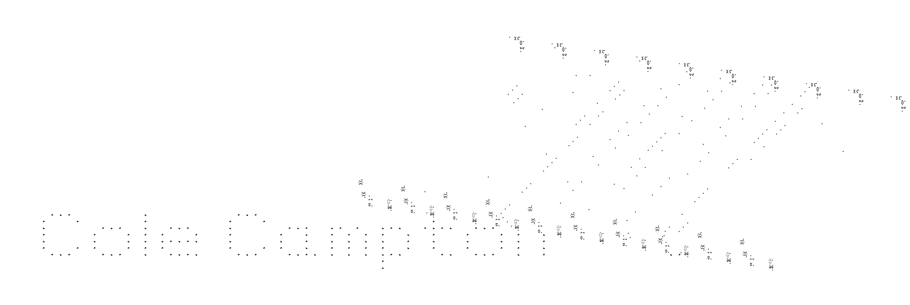
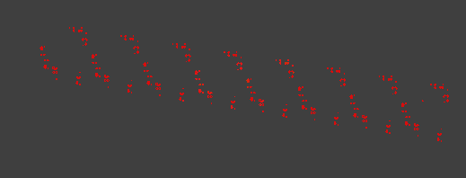
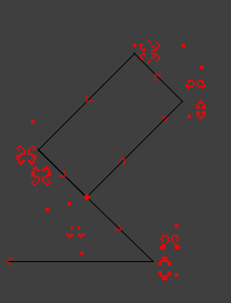
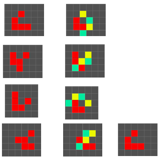
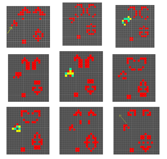
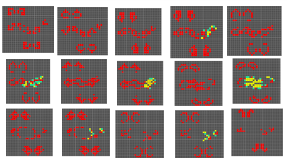
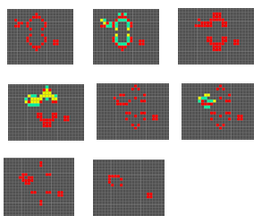

Conway's Game of Life is a construction which distplays emergent behavior and has been studied as a point of interest in artificial intelligence. The game evolves based on an initial set up of the board but involves no players. The following are rules for the evolution of the board at discrete time steps. 

1. Any live cell with fewer than two live neighbours dies, as if caused by underpopulation.
1. Any live cell with two or three live neighbours lives on to the next generation.
1. Any live cell with more than three live neighbours dies, as if by overpopulation.
1. Any dead cell with exactly three live neighbours becomes a live cell, as if by reproduction.

The purpose of this project was to investigate the intricate structure needed to create scrolling text in John Conway's Game of Life. In doing so I investigated several Game of Life structures and animated their full periods, coloring the transitions between stages. Below, red squares are squares that were alive in a previous stage and remain into the next (have two or three neighbors), yellow squares are squares that are no longer alive in the coming stage (do not have two or three neighbors), and green squares are grey dead squares that will come alive in the next stage (have exactly three living neighbors).

## Overall Structure

Shown above are eight pathways that each create pixels at a different height. A glider travels counter-clockwise, splits, then is ejected as a LWSS traveling to the left while the clone remains in the system.

* The pixel cycle takes 598 generations
* The glider split happens at generations 325 to 333
* The split glider re-enters the cycle between generation 405 and 411
* The glider is transformed into an LWSS between 551 and 554

## The Glider

The glider is the automata unit that allows for controlled movement in the loop. It has four generations. The transition is shown on the right with disappearing in yellow, appearing in green and remaining squares in red.

# The Glider Direction Change
The glider is directed in a loop to that determines when pixels are released. 
This is the process the glider goes through in being directed 90 degrees counter-clockwise that allows for the system to create a controlled cycle.

## The Glider Split
Through a seemingly chaotic collision in the lower right portion of the cycle the glider is split into two. 

## The Glider Split Redirection

The newly created glider then enters a collision to be redirected towards the starting position of the original glider. The original glider continues past.

## Glider to LWSS
The Light Weight Spaceship is an automata which proceeds stably in a coordinate axis direction.

The conversion of the glider into a Lightweight Spaceship creates each pixel that travels to the let across the screen.This occurs by another collision with a similar oscillating form.

The system appears extremely chaotic as it is input, but the system is still deterministic at it's root and can be formulated into a predictable output so that it is programmable. 

Make one for yourself! [The repository](https://github.com/cipan/life-gen/) , with instructions included/

The code is a correction to [Thomas Robinson's program](http://tlrobinson.net/blog/2009/02/game-of-life-generator/), to accommodate recent changes to Ruby.