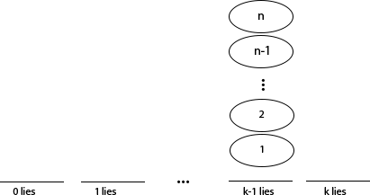
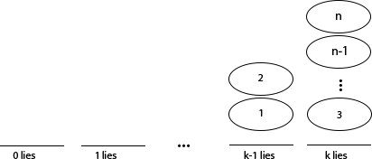
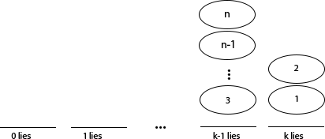

The Probabilistic Method is a method of proof first used by Paul Erdős. Erdős himself said during his 80th birthday conference, that he believes this method will live long after him. The method has the striking ability to build proofs of existence without actual construction. 

Each application of the methods follows the same general workflow

1. Describe the probability that an element of a set has a certain property.
1. Use the property to show that this probability occurs with a non-zero provability.
1. Then observe that an element with the chosen property must exist.

In the abstract this seems to be an obvious technique. The following provides an example to allow the reader to appreciate the magic-like power of Erdős' Probabilistic Method.

## The Chip-Liar Game

### Example: The Liar Game

1. Paul asks $$ q $$ questions in the form "Is $$ x\in S $$?" for any subset $$S$$
1. Determining x $$\in\left\{1,...,n\right\}$$
1. Carole doesn't necessarily need to select an $$x$$ beforehand, but at least one $$x$$ must be consistent with her answers.

For which $$n$$ numbers, $$q$$ questions, and $$k$$ lies are known by both Carole and Paul. Can Paul determine the number?
Use Probabilistic method to prove the existence of a winning strategy for one player.

### An Equivalent Game: Chip-Liar

1. Chip for each $$x$$. 
1. Board is a method for keeping track of lies each $$x$$ has remaining. 
1. Used to keep track of the possibility that each answer $$x \in S$$ and $$ x \not\in S$$ could be a lie. 
1. Chips are removed from the board past the 0th slot, they are not possible $$x$$'s. 

If there are more than one chips on the board at the end of the game then Paul cannot determine between them which is $$x$$ and Carol wins. 

### Playing Chip-Liar: Examples

#### Example 1
Imagine asking "Is $$ x \in \left\{ 1,2,..., n \right\} $$?". Clearly it is. Carole could respond no, but would certainly use a lie and move the whole stack left one unit. 

#### Example 2
Imagine asking "Is $$ x \in \left\{ 1,2 \right\} $$?"
Carole could answer "No", and has either lied or told the truth.

 Or she could answer "Yes" and has either lied or told the truth. 

At each round Carole can choose to either move $$S$$ or $${S}^{c}$$ one space to the left.

### Does a Chip Survive: Expected Value
1. Consider Carole playing randomly, moving $S$ or ${S}^{c}$.
1. For each $$c \in\left\{1,...,n\right\}$$ let $${I}_{c}$$ is 1 iff $$c$$ is on the board after $$q$$ rounds
1. If $$c$$ is on position $$j$$, $$c$$ will survive if chosen $$\le j$$ times.

#### Probability of Survival
$$ E\left[ {I}_{c} \right] = \frac { 1 }{ {2}^{q} } \sum_{i=0}^{j}{\begin{pmatrix}  q \\  i \end{pmatrix}} \stackrel{def}{=} B(q,j)$$

$$B(q,j)$$ to be the probability that a chip at $$j$$ survives q rounds.

## Expected Values
### Expected Number of Chips

1. Number chips on each space is given by $$\left\{x_{1},...,{x}_{k}\right\}$$ 1. The expected total number of chips is $$C$$ is the number of chips in a position times the probability each will survive the game

#### Expected total number of chips.
$$E\left[C\right]= \sum_{c}{E\left[{I}_{c}\right]} =\sum_{i=0}^{k}{x_{i}B(q,i)}$$

## Existence of a Winner

#### Game Theory: Theorem
In a game with perfect information, no hidden moves and no draws one player has a perfect winning strategy.

$$E\left[C\right]$$ weighted average of possibilities. If $$E\left[C\right] > 1$$,

1. $$E\left[C\right] = {C}_{1} \mu\left({C}_{1}\right)+...+{C}_{p} \mu\left({C}_{p}\right)>1 $$ implies $$\exists {C}_{k} > 1$$ with $$\mu\left({C}_{k}\right)>0$$ 
1. If some $${C}_{k} > 1$$ with $$\mu\left({C}_{k}\right)>0$$ then Carole is able to win.
1. So no strategy allows Paul to always win.
1. But by the Theorem someone has a perfect strategy that always wins, so it must be Carole. 

since $$\forall j$$ $$0\le{C}_{j}\le 1$$ and $$\sum_{j=0}^{p}{\mu\left({C}_{j}\right)}=1$$

### Corollary

1. $$E\left[C\right]=\sum_{i=0}^{k}{x_{i}B(q,i)}$$ gives $$\sum_{i=0}^{k}{x_{i}} B(q,k) = \left\{x_{1},...,{x}_{k}\right\} = \left\{0,...,n\right\}$$
1. When $$ E\left[C\right]>1$$ and Carole wins this gives $$\sum_{i=0}^{k}{x_{i}} B(q,k)>1$$
1. Rearranges to: $$\sum_{i=0}^{k}{x_{i}} > \frac{2^{q}}{B(q,k)}$$ and $$\sum_{i=0}^{k}{x_{i}} = n$$ yield

#### Corollary - Carole wins the $$n$$ number, $$q$$ question, and $$k$$ lie game
$$ n> \frac{2^{q}}{\sum_{i=0}^{k}{\begin{pmatrix}  q \\  i \end{pmatrix}}} $$

$$ \text{(Probability of removing an x) * (the number of x's)} > \text{(total number of subsets of x's)}$$

### De-randomization

1. Random play is expected to yield the same result, so the initial position will decide a better move. 
1. With $$l$$ moves remaining Carole's dominant strategy is to maximize the expected number of chips on the board playing randomly after moving $$S$$ or $${S}^{c}$$.

#### Strategy
$$ S\rightarrow \left({x}_{1}^{'},..., {x}_{k}^{'}\right) \text{ and }{S}^{c}\rightarrow \left({x}_{1}^{"},..., {x}_{k}^{"}\right) $$
$$ E\left[{C}^{'}\right]=\sum_{i=0}^{k}{x_{i}^{'}B(l,i)} \text{ and } E\left[{C}^{"}\right]=\sum_{i=0}^{k}{x_{i}^{"}B(l,i)} $$
$$\text{if } E\left[{C}^{'}\right]>E\left[{C}^{"}\right] \text{ then move } S \text{, otherwise move }{S}^{c}$$

